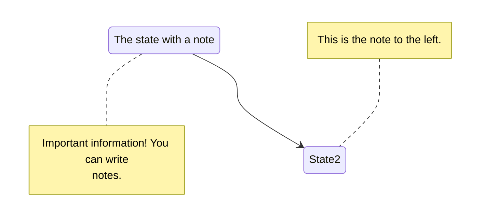

+++
title = "Ox-Hugo 블로깅 : 변환 문법 및 팁 🌲"
author = ["Junghan Kim"]
date = 2023-06-05
publishDate = 2023-07-14
lastmod = 2023-07-10
keywords = ["evergreen", "notes", "ox-hugo", "org-roam", "template"]
draft = false
+++

<style>details summary { color: green; }</style>

<style>details .details { color: blue; }</style>


Org-Roam 에서 작성한 문서를 Hugo Markdown 으로 변환하기는 쉽다. 근데 각주, 인용,
태그, 요약, 코드, 일부 내용 감추기 등을 어떻게 하는가? 여기에 대한 답을 찾는다.


<!--more-->

ox-hugo 의 모든 예제는 다음 주소에 있다. 여기서 찾아보자.&nbsp;[^fn:1]


## Add Org-Roam to Org-Agenda {#add-org-roam-to-org-agenda}

<span class="timestamp-wrapper"><span class="timestamp">[2023-07-14 Fri 15:56]</span></span>
롬 문서에서 어젠다 연결. 모든 문서를 다 연결하는 것은 오버헤드. 정책 위배.
파일 태그가 있는 노트만 어젠다로 등록.

```text
#+CATEGORY: 🍋Notes
#+filetags: :AGENDA:
```


## <span class="org-todo todo TODO">TODO</span> <code>[1/2]</code> Check Lists {#check-lists}

[ ] Sidenote and book_menu are collapsed
: after-menu.html

[X] mermaid caption 문제 -- 이미지로 넣어라.


## Heading {#heading}

<span class="timestamp-wrapper"><span class="timestamp">[2023-06-19 Mon 17:51]</span></span>
h2 은 레드 계열
heading 은 숫자보다는 정통 별표로 가는게 예쁘다.




### Heading 2 {#heading-2}

헤딩 h3 yello 계열


#### Heading 3 {#heading-3}

h4 blue
<span class="timestamp-wrapper"><span class="timestamp">[2023-06-19 Mon 17:51]</span></span>


## Sidenote 추가 정보 {#sidenote-추가-정보}


abc

사이드 노트에 대한 나의 사랑은 엄청 납니다.
 사이드 노트 예제 입니다.

사이드노트

아직 메뉴와 겹쳐지는 문제를 해결해야 합니다. 다만 사용하는데 지장 없습니다.
 는 좋습니다.

숏코드는 tempel 에 hugoside 로 만들어 두었습니다.




## Markup {#markup}

org-mode 마크업은 다음의 주소에서 확인 바람.&nbsp;[^fn:2]
ox-hugo 관련 내용은 다음 주소에서 확인.[^fn:3]
결과를 비교하면 org-code 와 verbatim 이 다르다. 맞춰줘야 한다.
verbatim 은 맞추기가 까다롭다. <kbd>kbd</kbd> 을 많이 사용하라!


-   헤딩에는 _ 만 사용하라!
-   본문에는 ~, = 깔끔하다.
-   \*, / 은 편하게 사용하되 헤딩에만 피해라!


-   **org-bold** : \*
-   <kbd>org-code</kbd> : ~ (org-hugo-use-code-for-kbd t)
-   _org-italic_ : /
-   ~~org-strike~~ : +
-   <span class="underline">org-underline</span> : _
-   `org-verbatim` : =




## Summary 블록 {#summary-블록}

요약문은 한글, 컬럼 80 으로 2.5 줄 정도 가능하다. 간단히 쓰는게 항상 답이다.
간단히 요약하기란 쉽지 않다. 하지만 중요하다. 아래와 같이 포스팅 맨 위에
짧은 글을 넣으면 된다. `#+hugo: more` 이 구분자 역할을 한다. 왠만하면 문서에
html 코드를 넣고 싶지 않다. 제공하는 방법을 사용한다.

```text
My post summary.

#+hugo: more

My post content.
```


## Citation 서지 정보 {#citation-서지-정보}

다음과 같이 상/하단에 넣어야 한다. 레퍼런스를 달아 봅니다.
`SPC B i` 로 바인딩을 해 놓았다. <a href="#citeproc_bib_item_1">[1]</a> <a href="#citeproc_bib_item_2">[2]</a>
citar 사용법을 여기서 다룰 것은 아니다. 아무튼 깔끔하게 들어간다.

```text
#+EXPORT_HUGO_PANDOC_CITATIONS: t
,[cite:@HaekeowaHwaga14]
#+print_bibliography:
Below, the "References" heading will be auto-inserted.
```

현재 라인 다음에 References 이 추가 된다.

## References

<style>.csl-left-margin{float: left; padding-right: 0em;}
 .csl-right-inline{margin: 0 0 0 1em;}</style><div class="csl-bib-body">
  <div class="csl-entry"><a id="citeproc_bib_item_1"></a>
    <div class="csl-left-margin">[1]</div><div class="csl-right-inline">P. Graham, <i>해커와 화가</i>. 2014. Available: <a href="http://www.yes24.com/Product/Goods/11775130">http://www.yes24.com/Product/Goods/11775130</a></div>
  </div>
  <div class="csl-entry"><a id="citeproc_bib_item_2"></a>
    <div class="csl-left-margin">[2]</div><div class="csl-right-inline">Jethro Kuan, “How I Take Notes with Org-roam,” 2022. <a href="https://jethrokuan.github.io/org-roam-guide/">https://jethrokuan.github.io/org-roam-guide/</a> (accessed May 16, 2023).</div>
  </div>
</div>


## Footnote 각주 관리 {#footnote-각주-관리}

각주는 이렇게 들어갑니다.&nbsp;[^fn:4]


## No Export {#no-export}

블로그 리포는 공개되어 있다. 여기에 Markdown 파일이 그대로 있다. 숨기고 싶은
또는 숨겨야 하는 내용이 분명히 있을 것이다. 그렇다면 org 파일에서 아래와 같은
방법으로 숨기면 된다. 아예 private 프로퍼티를 넣고 ox-hugo 에서 걸러주는
방법도 있다. 나는 왠만하면 다 내용을 오픈하고자 한다. 다만 문제가 되거나
퀄리티가 많이 부족한 부분은 `헤딩` 수준에서 숨기길 원한다.


### PRIVATE 설정 {#private-설정}

<span class="timestamp-wrapper"><span class="timestamp">[2023-07-10 Mon 10:10] </span></span> 내보내기 할 때 연결 된 노트가 미리 내보내기 되어 있어야
한다. 불편한 부분이다. 아직 내보내기 할 상태가 아닌데도 내보내기 할 필요가
있을까? 그렇다면 방법은 :PRIVATE: 를 프로퍼티에 넣는다. (커스텀 수정)
URL 이 있다면 URL 링크로 변경 되고 그게 아니라면 텍스트로 표시 된다.


### noexport 태그 활용 {#noexport-태그-활용}

아래 헤딩은 안보입니다. 뭔가 더 있는데 안보이죠? 그럼 된겁니다.

```text
* 숨기고 싶은 헤딩이라면 태그를 달아라 :noexport:
```


### 파일 숨기기 (비추) {#파일-숨기기--비추}

연결 된 노트를 작성하는 경우라면 좋지 않은 방법이다. 링크를 블록하는
처리를 해줘야 한다.

```text
,:EXPORT_FILE_NAME: excluded-post
```


## 코드, 인용, 예시 블록 {#코드-인용-예시-블록}

-   ':' 을 애용한다. 1 라인 블록.

    ```text
    안녕하세요. 간단해서 좋습니다.
    ```
-   example : 앞에 탭 사이즈 공백이 들어 간다.
    ```text
      위에 요약문의 분량입니다. 대략 2.5 줄 정도 입니다. 한글로.
    ```
-   quote

    > 위에 요약문의 분량입니다. 대략 2.5 줄 정도 입니다. 한글로.
-   src
    소스코드 블록이다.
    ```emacs-lisp
      (with-eval-after-load 'ox-hugo
        (setq org-hugo-auto-set-lastmod 't
              org-hugo-section "posts"
              org-hugo-suppress-lastmod-period 43200.0
              )
    ```
-   center

    <style>.org-center { margin-left: auto; margin-right: auto; text-align: center; }</style>

    <div class="org-center">

    위에 요약문의 분량입니다. 대략 2.5 줄 정도 입니다. 한글로.

    </div>
-   verse

    <div class="verse">

    위에 요약문의 분량입니다. 대략 2.5 줄 정도 입니다. 한글로.<br />

    </div>


## 태그를 키워드로 변환 {#태그를-키워드로-변환}

키워드로 빼고 태그는 명시하는게 좋겠다. 태그와 카테고리는 관리가 필요하다.
지식 관리를 할 때 태그, 카테고리는 매우 중요한 분류 방법이다.
태그를 마구잡이로 잡는 것은 좋지 않은 방법이다. 대략 분류를 해놓고 그 안에서
설정을 하는게 좋다. 특히 디지털 가든에서는 태그 관리가 더 중요하다.
그래서 파일 태그가 이리저리 많더라도 변환 할 때는 키워드로 할당되도록 한다.
즉 블로그의 태그는 적절하게 관리한다. 자동화가 언제나 효과적인 것은 아니다.

```text
#+hugo_front_matter_key_replace: tags>keywords
```


## Shotcodes 지원 {#shotcodes-지원}

<span class="timestamp-wrapper"><span class="timestamp">[2023-06-08 Thu 12:19]</span></span>
Hugo Book 데모 페이지를 확인한다.&nbsp;[^fn:5]

여기에 보면 문서 편집하기 위한 여러 코드들을 제공하고 있다. 나는 마크다운으로
편집하지 않기 때문에 각각 기능 검증이 필요하다. ox-hugo 가 있으니 문제 될 것은
없다. 오히려 이맥스의 확장성을 제한하기 때문에 선택과 집중이 필요하다.


### hint and details {#hint-and-details}

<span class="timestamp-wrapper"><span class="timestamp">[2023-06-05 Mon 13:44]</span></span>
org 파일에서 제공하는 기능은 아니지만 블로그에서 보다 정보를 깔끔하게 정리하기
위해서 short-code 를 사용할 수 있다. 스니펫으로 만들어 놓으니 아주
편리하다.

이맥스의 기본 Quote 변환. 나는 serif 폰트로 변경했다.

> Quote 인용문

hint 에서 레벨에 맞는 컬러 효과가 가능하다.


hint info 인포



hint warning 경고



hint error 에러


expand 도 가능하다. (details)


****Markdown content****
Lorem markdownum insigne. Olympo signis Delphis! Retexi Nereius nova develat
stringit, frustra Saturnius uteroque inter! Oculis non ritibus Telethusa



### <span class="underline">mermaid</span> diagram {#diagram}



벡터 포멧을 지원하지 않지만 PNG 로 바로 결과를 확인하고 내보내기가 가능한
ob-mermaid 를 활용하는게 더 편하다. 보는 입장에서도 이미지가 더 활용하기 쉽다.


mermaid 다이어그램을 생성하는 방법은 2 가지다.

1.  org-babel : ox-mermaid
2.  Short-code : mermaid

아래와 같은 코드를 변환한다고 하자.


stateDiagram-v2
    State1: The state with a note
    note right of State1
        Important information! You can write
        notes.
    end note
    State1 --&gt; State2
    note left of State2 : This is the note to the left.


org-babel 의 이점은 org 문서에서 바로 결과를 확인할 수 있다는 점이다. 편집하면서
바로 보고 블로그로 바로 내보내면 된다. 물론 로컬에 mermaid 를 설치해 놓아야
한다. 물론 ob-mermaid 로 설정은 기본이다.&nbsp;[^fn:6]

```text
npm install -g @mermaid-js/mermaid-cli
```

단점은 명확하다. png 만 지원 된다.

Ob-Mermaid 이용한 결과다. png 파일의 한계.

<kbd>:exports</kbd> 옵션은 code, results,  both, none&nbsp;[^fn:7]


<div class="src-block-caption">
  <span class="src-block-number">Code Snippet 1:</span>
  My class diagram (code and png)
</div>



Short-code 를 이용한 결과. 벡터 포멧의 장점
적절히 사용하면 된다. 다만 캡션이 왜 안들어가는지 확인이 필요하다.
위의 방식과 다르게 해야 한다.


stateDiagram-v2
    State1: The state with a note
    note right of State1
        Important information! You can write
        notes.
    end note
    State1 --&gt; State2
    note left of State2 : This is the note to the left.



### <span class="org-todo todo TODO">TODO</span> <span class="underline">d2</span> diagram {#diagram}

<span class="timestamp-wrapper"><span class="timestamp">[2023-06-16 Fri 12:52]</span></span>
동작은 되는데 설정하는 방법을 좀 봐야겠다. 억지로 꼳 가져갈 필요 없다.


### Details and Summary {#details-and-summary}

details


<summary>Why is this in <b>green</b>?</summary>

You will learn that later below css section.


summary 블록을 사용하면 다음과 같다. 헤딩을 무시

<summary>Why is this in <b>green</b>?</summary>

일반 리스트는 헤딩 아래에 들어간다. 다음과 같다.

-   Why is this in **green**?


### <span class="org-todo todo TODO">TODO</span> katex and math typesetting {#katex-and-math-typesetting}

<span class="timestamp-wrapper"><span class="timestamp">[2023-06-08 Thu 12:18]</span></span>
Emacs 가지는 옵션도 많이 있다. 가장 범용적이고 쉬운 방법을 선택할 것이다.
org 모드로 편집하기 때문에 여기서 preview 가 되는 것이 가장 중요하다.


### <span class="org-todo todo TODO">TODO</span> 결과에 <kbd>caption</kbd> 넣는 방법 {#결과에-caption-넣는-방법}

<span class="timestamp-wrapper"><span class="timestamp">[2023-06-08 Thu 12:25]</span></span>
변환 된 코드 블록의 결과 이미지에 캡션을 넣어야 한다.


## Org-translate 블록 번역 {#org-translate-블록-번역}

<span class="timestamp-wrapper"><span class="timestamp">[2023-06-08 Thu 12:52]</span></span>
블록 번역 테스트.

```text
,#+BEGIN_SRC translate :src en :dest ko :noexport
```

코드 블록을 번역 하여 하단에 삽입한다.

```translate
  Doom is a configuration framework for GNU Emacs tailored for Emacs bankruptcy
  veterans who want less framework in their frameworks, a modicum of stability
  (and reproducibility) from their package manager, and the performance of a
  hand rolled config (or better). It can be a foundation for your own config or
  a resource for Emacs enthusiasts to learn more about our favorite operating
  system.
```

Doom 은 프레임워크에 적은 프레임워크, 패키지 관리자의 약간의 안정성(및 재현성),
수동 구성의 성능(또는 그 이상)을 원하는 Emacs 파산 베테랑을 위해 맞춤화된 GNU
Emacs 용 구성 프레임워크입니다. 자신의 구성을 위한 기초가 될 수도 있고 Emacs
애호가가 선호하는 운영 체제에 대해 자세히 알아볼 수 있는 리소스가 될 수도
있습니다.


## Header Template {#header-template}


capture 를 하면 아래와 같이 노트의 타입에 맞게 헤더가 생성 된다. publish,
lastmod 는 직접 수정 한다. 그래야 깔끔하다.

```text
,:PROPERTIES:
,:ID:       3dcd5b7a-9e78-41a9-a3da-xxxxxxxx
,:END:
#+title: HELLO WORLD
#+date: <2023-06-22 Thu 10:27>
#+hugo_publishdate: <2023-06-22 Thu 10:27>
#+hugo_lastmod: <2023-06-22 Thu 10:27>
#+filetags: :notes:
#+HUGO_DRAFT: true
#+HUGO_SECTION: notes
```

노트를 캡처 하면 아래와 같다.



그 다음에 template 을 가져 온다. 자동으로 가능한 부분을 거의 다 제거 했다.
내보내기 전에 확인하고 직접 하는 것이 노트에 대한 나의 자세가 아닐까 싶다.

아 물론 SETUPFILE 을 이용해서 표준화 시킬 수 있다. 그렇게 했었다. 근데 이 또한
섣부른 자동화가 아닐까? 하루에 1-2 개 노트를 만드는데 뭘 더 자동화 하려는
것인가?! 귀하게 다루자. 받들어 모시자.

```text

(hugofront "
,# :ROAM_ALIASES: \"==\"
#+SUBTITLE:
#+URL:
#+LANGUAGE: ko
,# #+STARTUP: overview

,# == TAGS ==
,# 🌱 🪴 🌳
#+filetags: :draft:
#+filetags: :seedling:
#+HUGO_TAGS:

,# == Taxonomies ==
,# #+HUGO_CATEGORIES:
,# #+HUGO_SERIES:

,# == Glossary ==
#+glossary_sources: glossary-general

,# == Front-matter ==
#+hugo_front_matter_key_replace: tags>keywords
,# #+hugo_front_matter_key_replace: aliases>nil
,# #+hugo_paired_shortcodes: hint details mermaid sidenote
#+EXPORT_HUGO_PANDOC_CITATIONS: t
,# #+print_bibliography:

,# == Summary ==

#+attr_shortcode: info
#+begin_hint" n> r> n>
",#+end_hint

#+hugo: more

* HIDDEN :noexport:
* ChangeLog :noexport:

")
```

[^fn:1]: <https://raw.githubusercontent.com/kaushalmodi/ox-hugo/main/test/site/content-org/all-posts.org>
[^fn:2]: <https://orgmode.org/manual/Markup-for-Rich-Contents.html>
[^fn:3]: <https://ox-hugo.scripter.co/doc/formatting>
[^fn:4]: [How I Take Notes with Org-roam](https://jethrokuan.github.io/org-roam-guide/)
[^fn:5]: <https://hugo-book-demo.netlify.app/docs/shortcodes/katex/>
[^fn:6]: <https://github.com/arnm/ob-mermaid>
[^fn:7]: <https://orgmode.org/manual/Exporting-Code-Blocks.html>